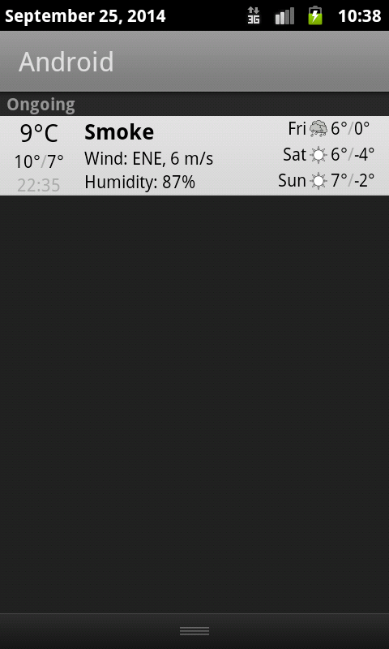
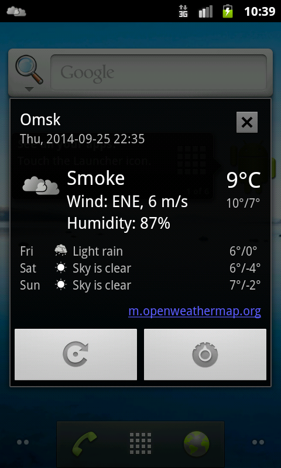
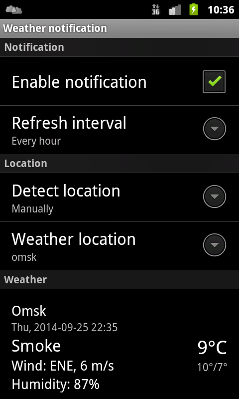
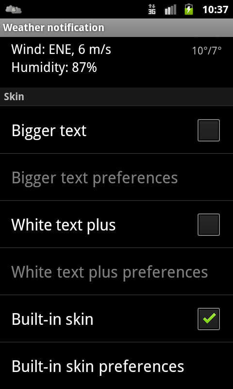
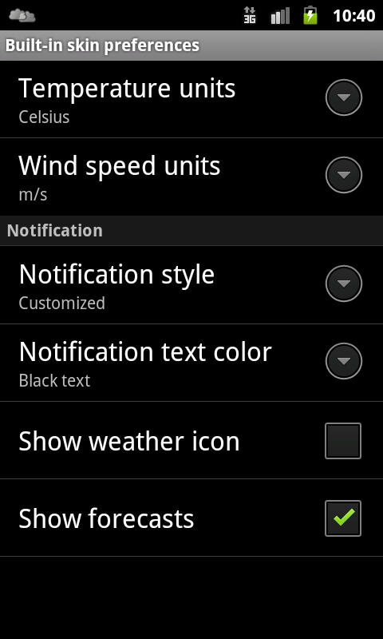

Simple application which displays the air temperature and other weather conditions in the Android notification bar.
The air temperature is always visible like a system clock.

Downloads
---------

[Google Play](https://play.google.com/store/apps/details?id=ru.gelin.android.weather.notification)

[F-Droid](https://f-droid.org/repository/browse/?fdid=ru.gelin.android.weather.notification)

Screenshots
-----------

License
-------

This program is free software: you can redistribute it and/or modify it under the terms of the GNU General Public License as published by the Free Software Foundation, either version 3 of the License, or (at your option) any later version.

This program is distributed in the hope that it will be useful, but WITHOUT ANY WARRANTY; without even the implied warranty of MERCHANTABILITY or FITNESS FOR A PARTICULAR PURPOSE.  See the GNU General Public License for more details.

You should have received a copy of the GNU General Public License along with this program. If not, see http://www.gnu.org/licenses/.